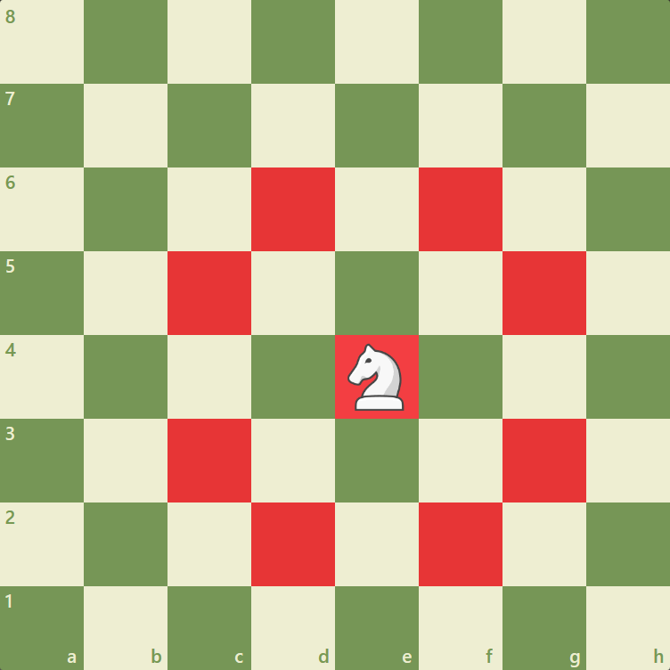
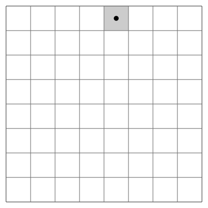

# Starter repo for SP25 CSE116 TA vs Professor coding challenge

Your challenge is to create an algorithm to solve the **Knight's Tour** problem. The goal of this problem is to find a path across a chess board of arbitrary size, starting from an arbitrary position, that visits every tile, according to the movement rules of the knight chess piece.
  
If you are unfamiliar, a knight can move two tiles in one direction, and another tile in a perpendicular direction. Thus, a knight has a maximum of 8 moves from any given position. See the image below as an example

This graphic shows one possible knight's tour being completed on an 8x8 grid.

There are many possible knight's tours that can be created from a given board size and starting position. In fact, a grid of size 8x8 has 19,591,828,170,979,904 (~19.6 quadrillion) possible tours. You only need to find one of them :)

## Specifications

The only requirement is that you have a method called *solve* in the *Solver* class. The method header was provided to you, but in case you accidentally modified it, it should take three *int*s representing the size of the board and the x and y locations of the starting position, respectively. It should return a *HashMap<Vector2D, Integer>*, where each key is a valid position within the board and its corresponding value is it's order in the tour.

   
Note that the board is indexed from 0, meaning that a 5x5 board has valid indices in the range 0-4. Additionally, the tour should be indexed from 0, meaning the starting position maps to 0 in the returned HashMap

As a concrete example, take the image below

This is obviously not a correct tour, and in fact there does not exist a complete tour on a board size of 3x3. However, for the sake of the example, this board would have a HashMap that appears as follows:  
\{  
	<0,0>: 0  
	<2,1>: 1  
	<0,2>: 2  
	<1,0>: 3  
	<2,2>: 4  
	<0,1>: 5  
	<2,0>: 6  
	<1,2>: 7  
\}

There are some special considerations that must be made in your method. This problem is not solvable for sizes smaller than 5x5, so if the input size is less than 5, you should return an empty HashMap. You should do the same if the starting x or y coordinates are outside the bounds of the grid. Additionally, the problem is only solvable for boards of odd size when the sum of the x and y coordinates of the starting point is even. This is because of graph coloring reasons that I don't feel like getting into, but it will be tested.

For this challenge, all of the boards will be square.

You have been provided with several helper classes and methods that you may use if you wish to. The Vector2D class is nearly identical to the one from the game engine homework, except that it takes ints instead of doubles. The Board class gives a simple, though likely inefficient, way to keep track of the grid as you perform the algorithm, along with a couple helper methods.

You may add any additional classes or methods that you want.

Remember that you are not just competing for correctness, but efficiency. The most obvious solution is quite slow, and there are some rather simple optimizations that can be made, either to the algorithm itself or to the underlying data structures.

Good luck!
